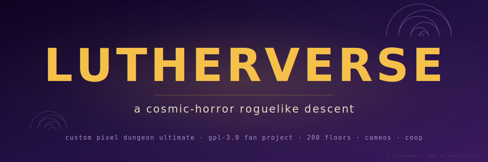

<p align="center">
  
</p>

<h1 align="center">Lutherverse</h1>

<p align="center">
  <em>A 200-floor roguelike descent that keeps changing shape on you.</em>
</p>

<p align="center">
  <a href="LICENSE.txt"></a>
  
  
  
  
  <a href="https://github.com/luther-rotmg/CustomPixelDungeonUltimate/stargazers"></a>
  <a href="https://github.com/luther-rotmg/CustomPixelDungeonUltimate/watchers"></a>
</p>

---

## What is this

Lutherverse (repo name: `CustomPixelDungeonUltimate`) is a fork of [Custom Pixel Dungeon](https://github.com/QuasiStellar/custom-pixel-dungeon), which is itself a fork of [Shattered Pixel Dungeon](https://github.com/00-Evan/shattered-pixel-dungeon). It uses CPD's marketplace-mod framework and extends the game on top of it. I want it to be the kind of project a small group of people obsess over for a long time.

Shattered Pixel Dungeon is about 25 floors of tight, replayable dungeon crawling. Lutherverse stretches that into a 200-floor run that keeps shifting tone as it goes: a hyper-utopian future with something wrong underneath, a version of Zanarkand you weren't supposed to see, calm plains that stop feeling calm. There's a story running through the whole thing, cameos of characters you'll recognize, keyblades as their own weapon type, save zones between big fights, towns every ten floors, a sphere-grid progression system, and coop you can play with a friend on their phone.

The mood is cosmic horror. Junji Ito and HP Lovecraft on the aesthetic side. Bloodborne, Final Fantasy X, and Kingdom Hearts 2 on the game-design side. Written in Java on libGDX, all GPLv3.

---

## The vision

<details open>
  <summary><strong>Core gameplay</strong></summary>

- 200 floors, about eight times what Shattered Pixel Dungeon runs by default, with new content the whole way up.
- A sphere-grid skill system inspired by Final Fantasy X. Nodes unlock along paths and either replace or wrap Shattered's talent tree depending on how the refactor lands.
- Combat is toggleable per run: the classic real-time roguelike mode Shattered ships, or a Final Fantasy X style turn-based action queue.
- Save zones borrowed from Kingdom Hearts 2. Checkpoint rooms where you can rest. Two per-run toggles: whether they heal you, and whether they appear at all (that second one is the hardcore mode).
- A town every ten floors for buying, selling, trading, crafting, resting, and quests. One city recurs for about thirty floors at a time and evolves as the player's choices reach back into it: different quest steps, different inventories, different events.
- Keyblades as a real weapon type, not a subclass of swords. A dual-wield reward system feeds into a Keybearer hero class built around dual keyblades. Endgame variants are crafted from orichalcum.

</details>

<details>
  <summary><strong>Aesthetic direction</strong></summary>

- Cosmic horror: Junji Ito (Uzumaki spirals, Tomie's designs) and HP Lovecraft (existential dread, deep-ones, mythos creatures).
- Bloodborne: chalice-dungeon-style procedural mini-dungeons, a fountain-shaped shop, gothic ambient horror.
- Final Fantasy X: Zanarkand, the Calm Lands, Sin as a recurring apocalyptic threat, Aeons as summonable creatures, the sphere grid.
- Kingdom Hearts 2: world-hopping between tonally distinct settings, keyblades, the save-zone save/load pattern.
- Cameos: Sora (KH), the Doll (Bloodborne), Patches (FromSoft), Tidus and O'aka (FFX), plus lighter nods to GTA, Warframe, Naruto, DBZ, and Binding of Isaac.
- Each stretch of floors feels distinct. The dungeon changes shape as it deepens.

</details>

<details>
  <summary><strong>Multiplayer</strong></summary>

Two coop modes for two kinds of session:

- Real-time coop. Pick a nickname, make a room, no self-hosted servers. The lobby toggles which addons count as "cheats" and can be turned off (God-tier starter gear counts; Hard mode and Bonfire mode don't).
- Turn-based coop inspired by Nestalgia. A four-unit party split across the players (one player controls all four, two players get two each, four players get one). Meant for async play with a friend on their phone. Pairs with the turn-based combat toggle above.

</details>

<details>
  <summary><strong>Community goodies</strong></summary>

- Leaderboards.
- Labeled seed sharing: `seed COSMICNIGHTMARE-1` instead of `seed 12345`.
- A story running through all 200 floors, with cutscenes and dialogue.
- A modding-platform API so other people can add biomes, mobs, weapons, and story branches.

</details>

---

## Roadmap

Every substantive commit updates this section. It's the accurate current state, not a snapshot from a while ago.

**Sub-projects (v0.1 track):**

| Sub | Name | Status | Notes |
|---|---|---|---|
| A | Fork infrastructure | ✅ done | This repo. Attribution, docs, branch rename `margarita` to `main`. |
| B | Upstream sync (CPD to SPD v3.3.8) | 🟡 planning | Bring the game engine current with Evan's latest. Merge-in-slices strategy. |
| C | Broad modding-platform API | ⏳ next | Java-hook API on top of CPD's JSON-manifest framework: cutscenes, dialogue, dual-wield, story flags, biome swapping, NPC insertion. |
| D | God Mode addon | ⏳ | Top-tier starter gear. Flagged as "cheat" in coop lobby. |
| E | Hard Mode addon | ⏳ | Balance tuning. Coop-fair. |
| F | Bonfire Mode addon | ⏳ | Permadeath modifiers plus rest-checkpoint economy. Coop-fair. |

**Post-v0.1 waves.** These need their own brainstorm passes. The list below is a direction, not a commitment schedule.

- Sphere Grid progression system
- Keyblade weapon type · Keybearer class · dual-wield reward system
- Turn-based combat toggle
- Save zones · towns · quest system · narrative-state module
- 200-floor generator + biome variety framework · cosmic-horror biome pack
- Character cameo framework + first cameos
- Real-time coop (Sub-K)
- Nestalgia-style turn-based coop
- Leaderboards + labeled seed sharing
- Story spine + cutscene/dialogue engine

---

## Alpha testers and watchers

There's nothing new to play yet. The fork is at its base commit and Sub-B is next. If the roadmap sounds like something you want to see happen, starring the repo bookmarks it for later, and switching Watch to Custom then Releases will ping you when the first alpha ships.

Issues are welcome. Bugs, feature ideas, cameo suggestions, all fine. Pull requests aren't being accepted right now because the modding API isn't stable and every hook is likely to change. That loosens up when Sub-C ships.

---

## Attribution

Lutherverse is GPL-3.0. It carries the attribution chain forward:

- Base game: *Shattered Pixel Dungeon* by Evan Debenham. [00-Evan/shattered-pixel-dungeon](https://github.com/00-Evan/shattered-pixel-dungeon).
- Modding framework: *Custom Pixel Dungeon* by QuasiStellar. [QuasiStellar/custom-pixel-dungeon](https://github.com/QuasiStellar/custom-pixel-dungeon).
- Predecessor: *Pixel Dungeon* by Watabou.

See [`THIRD_PARTY_NOTICES.md`](THIRD_PARTY_NOTICES.md) for the GPL fork chain plus the currently-audited library notices (libGDX, RoboVM/MobiVM, SPD-classes). The remaining Apache/BSD/MIT dependency notices (FreeType, LWJGL, Kotlin, Ktor, SLF4J, org.json, gdx-controllers, androidx.multidex) get added before the first alpha binary ships; Sub-B tracks that.

Not affiliated with, endorsed by, or connected to any of the games or franchises Lutherverse takes creative inspiration from. Character cameos are non-commercial fan-project references.

---

## License

GPL-3.0. See [`LICENSE.txt`](LICENSE.txt).

If you use or modify this code, your derivative work has to also be GPL-3.0. Those are the terms Evan set for Shattered Pixel Dungeon and we keep them.

---

## Platform support

| Platform | Status |
|---|---|
| **Android** | Supported. See build instructions below. |
| **Desktop** (Windows / macOS / Linux) | Supported. See build instructions below. |
| **iOS** | Not supported. QSR removed the `ios/` directory from CPD in May 2023, so there is no iOS code in this repo. The `:ios` entry in `settings.gradle` is a leftover pointing at nothing. Sub-B or a follow-up either deletes the entry or resurrects iOS from SPD upstream if it becomes a goal. |

---

## Building

### Prerequisites

- JDK 17+
- Android SDK for the Android build (compile-SDK 33, build-tools 33.0.2)

### Android APK

```
./gradlew android:assembleDebug
```

The debug APK lands in `android/build/outputs/apk/debug/`.

### Desktop JAR

```
./gradlew desktop:release
```

The runnable JAR lands in `desktop/build/libs/`.

---

## Modding

The modding framework is whatever Custom Pixel Dungeon ships right now: JSON manifest per mod, resource overrides, hero JSON merge semantics. Refer to CPD's mod documentation until Sub-C adds the broader Java-hook API. Once it does, its reference docs will live at `docs/modding-api-v1.md` (nothing there yet).

---

## Development docs

- [CHANGELOG.md](CHANGELOG.md): every substantive commit.
- [PROJECT-STATUS.md](PROJECT-STATUS.md): what I'm working on right now, what's blocking me, what's coming next.
- [Design specs](docs/superpowers/specs/): sub-project design docs.
- [Implementation plans](docs/superpowers/plans/): task-by-task plans for each sub-project.
- [Assets](docs/assets/): images and design assets.

<p align="center">
  <sub>Lutherverse is a fan project by <a href="https://github.com/luther-rotmg">luther-rotmg</a>, built on top of Watabou, Evan, and QSR's work.</sub>
</p>
